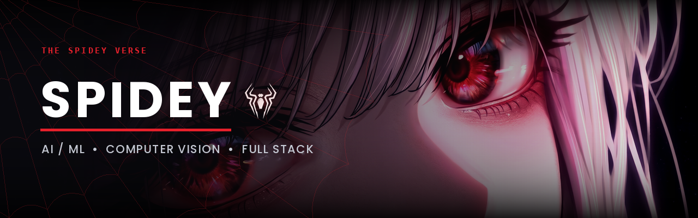
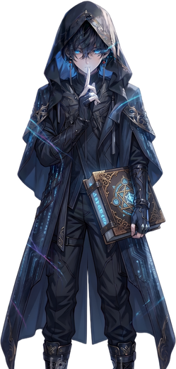
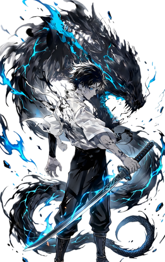

<div align="center">
  
</div>

<div align="center">

[](https://github.com/AAYUSH-SPIDEY-SHARMA)

</div>


## Quick Intro

<table>
<tr>
<td width="62%" valign="top">

### 👨‍💻 Aayush Sharma aka SPIDEY 🕷️

<table width="100%">
<tr>
  <td align="center" width="46">🎓</td>
  <td><b>AI &amp; ML Student</b><br/><sub>IIIT Lucknow</sub></td>
</tr>
<tr>
  <td align="center">🏀</td>
  <td><b>National Bronze Medallist (SGFI)</b><br/><sub>Dont know how to play basketball</sub></td>
</tr>
<tr>
  <td align="center">🎮</td>
  <td><b>Veteran gamer</b><br/><sub>A decade deep in the lobbies</sub></td>
</tr>
<tr>
  <td align="center">🌸</td>
  <td><b>Anime</b><br/><sub>Anime is Water , water is Good , Anime is Good</sub></td>
</tr>
<tr>
  <td align="center">🕸️</td>
  <td><b>Currently</b><br/><sub>Building AimPeak — and whatever comes next</sub></td>
</tr>
</table>

> Two things I never miss: a deadline, and a free throw.

</td>
<td width="38%" valign="top">

<div align="center">
  
</div>

</td>
</tr>
</table>


## Tech Stack

<div align="center">

<table>
<tr>
  <td align="right"><b>&nbsp;Languages&nbsp;</b></td>
  <td><a href="https://skillicons.dev"></a></td>
</tr>
<tr>
  <td align="right"><b>&nbsp;AI&nbsp;/&nbsp;ML&nbsp;</b></td>
  <td><a href="https://skillicons.dev"></a></td>
</tr>
<tr>
  <td align="right"><b>&nbsp;Web&nbsp;&amp;&nbsp;Backend&nbsp;</b></td>
  <td><a href="https://skillicons.dev"></a></td>
</tr>
<tr>
  <td align="right"><b>&nbsp;Data&nbsp;&amp;&nbsp;Infra&nbsp;</b></td>
  <td><a href="https://skillicons.dev"></a></td>
</tr>
</table>

</div>


## Projects

<table>
<tr>
<td width="50%" valign="top">

### 🎯 AimPeak

An AI-powered test platform built for JEE and NEET aspirants — practice, mock exams, and performance analytics in one place.

`TypeScript` `AI` `Web`

<!-- Paste the deployed link here: [**Live →**](https://your-link) -->

<sub>🔗 live link coming soon</sub>

</td>
<td width="50%" valign="top">

### 🟥 DOTCODE

Currently in development.

`TypeScript`

<!-- Paste the deployed link here: [**Live →**](https://your-link) -->

<sub>🔗 live link coming soon</sub>

</td>
</tr>
<tr>
<td width="50%" valign="top">

### 🌌 Aether

The official website for **Aether** — the Data Science and AI/ML club of IIIT Lucknow.

`React` `TypeScript` `Node`

[**Live →**](https://aether-frontend-inky.vercel.app)

</td>
<td width="50%" valign="top">

### 🧩 HRMS

A human resource management system — employee records, attendance, and admin workflows in a single dashboard.

`JavaScript` `Node` `Dashboard`

[**Live →**](https://hrms-beryl-delta.vercel.app)

</td>
</tr>
<tr>
<td width="50%" valign="top">

### 🕸️ Portfolio

My corner of the internet — work, writing, and everything else worth showing.

`JavaScript` `Web`

[**Live →**](https://aayushsharma.me)

</td>
<td width="50%" valign="top">

### ⚡ More

Plenty more in the repos — experiments, hackathon builds, and open source contributions.

[**Browse all →**](https://github.com/AAYUSH-SPIDEY-SHARMA?tab=repositories)

</td>
</tr>
</table>


## Open Source & Hacktoberfest

<div align="center">

Every October the web gets a little wider.

[](https://holopin.io/@aayushspideysharma)

</div>


## Contribution Signal

<div align="center">


<br/><br/>


</div>


## Alter Egos

<div align="center">
<table>
<tr>
<td align="center" width="33%">
  <br/>
  <b>THE GAMER</b><br/>
  <sub>Reflexes built over a decade of lobbies.</sub>
</td>
<td align="center" width="33%">
  <br/>
  <b>THE AI ENGINEER</b><br/>
  <sub>Turns data into something that decides.</sub>
</td>
<td align="center" width="33%">
  <br/>
  <b>THE BALLER</b><br/>
  <sub>National bronze. Hungry for more.</sub>
</td>
</tr>
</table>
</div>


<details>
<summary><b>💝 An Unforgettable Moment @ IIIT Lucknow</b> — click to open</summary>

<br/>

<table>
<tr>
<td width="58%" valign="top">

### 💫 The Story

In the bustling corridors of IIIT Lucknow, amidst the chaos of code and classes, there exists a moment frozen in time. A moment where I saw her from across the campus, and the world seemed to pause. It wasn't just about coding the future anymore; it was about the beautiful journey of life itself.

Sometimes the most beautiful algorithms are the ones written by the heart. ❤️

> "Not all variables in life can be defined, and not all feelings can be compiled. Some are meant to be cherished in the memory stack forever." 💭

</td>
<td width="42%" valign="top">

<div align="center">
  
</div>

</td>
</tr>
</table>

### 💌 Love Variables

```python
feelings = "undefined"
courage  = 0
memories = float('inf')
hope     = True

while hope:
    remember()
```

</details>


## Get in Touch

<div align="center">

Open to collaborations, hackathon teams, and open source work.

<a href="https://aayushsharma.me">
  
</a>
<a href="https://www.linkedin.com/in/aayush-sharma-661179330/">
  
</a>
<a href="mailto:sharmaaayush598@gmail.com">
  
</a>
<a href="https://x.com/Aaayushhh">
  
</a>
<a href="https://discord.com/users/theaayushsharma11">
  
</a>

</div>

<br/>

<div align="center">


**With great code comes great responsibility.**

<sub>Thanks for swinging by. If something here was useful, a star is a fine way to say so.</sub>

</div>
